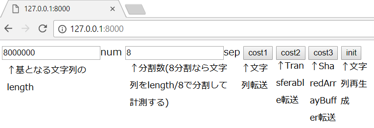
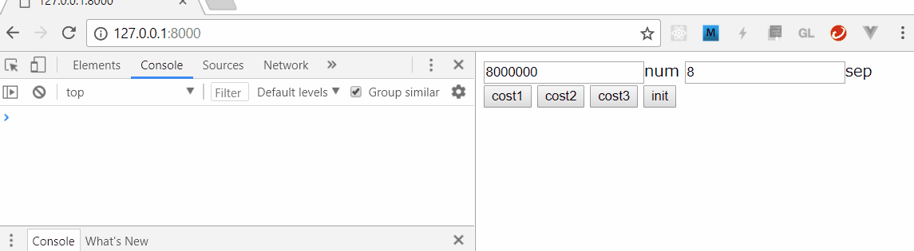

### 7.2_DataTransferForWorker

Web Workerへのデータ転送時間を測定するツール。

基となる文字列長と分割数を指定して、「分割した1度目の速度」を測定する。

例えば8万文字列/8分割で指定した場合、8万文字列から1万文字列を切り出してWeb Workerへ転送するまでの時間を測定することになる。

比較できるものは以下の3ケース。

- **cost1** stringをsliceにより分割して(cost1_1として表示)、そのままオブジェクトとしてWeb Workerへ転送(cost1_2and3として表示)
    - メリット: stringをsliceするだけになるので、初期化コスト(cost1_1)が低い。
    - デメリット: 転送時(cost1_2and3)にデータコピーコストを支払うことになる。
- **cost2** stringを文字コードとしてFloat32Arrayに詰め込み(分割ごとに1Buffer)(cost2_1として表示)、それをTransferableとしてWeb Workerへ転送(cost2_2として表示)
    - メリット: 転送時(cost2_2)にデータコピー無しで参照だけ渡すことができる。
    - デメリット: 初期化時(cost2_1)に文字列の文字コード変換とBuffer生成のコスト支払うことになる。
- **cost3** stringを文字コードとしてSharedArrayBufferに詰め込み(全文字1Buffer)(cost3_1として表示)、それをWeb Workerへ転送(cost3_2and3として表示)
    - メリット: 一度初期化すると、2度目以降の分割コストがない。転送時(cost3_2and3)にデータコピー無しで参照だけ渡すことができる。
    - デメリット: 初期化時(cost3_1)に文字列長分の文字コード変換とBuffer生成のコストを支払うことになる。転送後(cost3_2and3の一部)にSharedArrayBufferからsliceしているので、そこでデータ生成コストがかかる(ただしWorker内なので分散作業にはなっている)

#### 前提

- python 3.x系 : ローカルサーバ立ち上げバッチ(openserver.bat)で利用している。ブラウザ上でhtmlを見るのに別の方法を用いるなら不要。
    - ```$ python```で動作するようにpathを設定しておくこと

#### ツール使用方法

 1. $ git clone \<repository URL\>
 1. $ cd \<cloned path\>\7.2_DataTransferForWorker\WebContent\
 1. $ openserver.bat
 1. ブラウザを立ち上げ、以下に接続する
    - http://127.0.0.1:8000
 1. ブラウザでF12キーを押し、開発者ツールを表示する（コンソールに結果が出るため）
 1. 画面構成は以下の通り
    
 1. 適宜クリックし、結果をコンソールに表示する。文字列長や分割数を変更する場合はinitをクリックする。cost1は2度目以降sliceの結果がブラウザにキャッシュされ高速化されるので、逐一initをクリックする。
    
