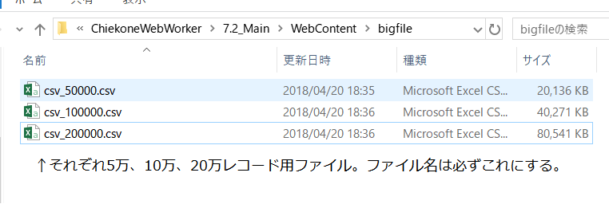
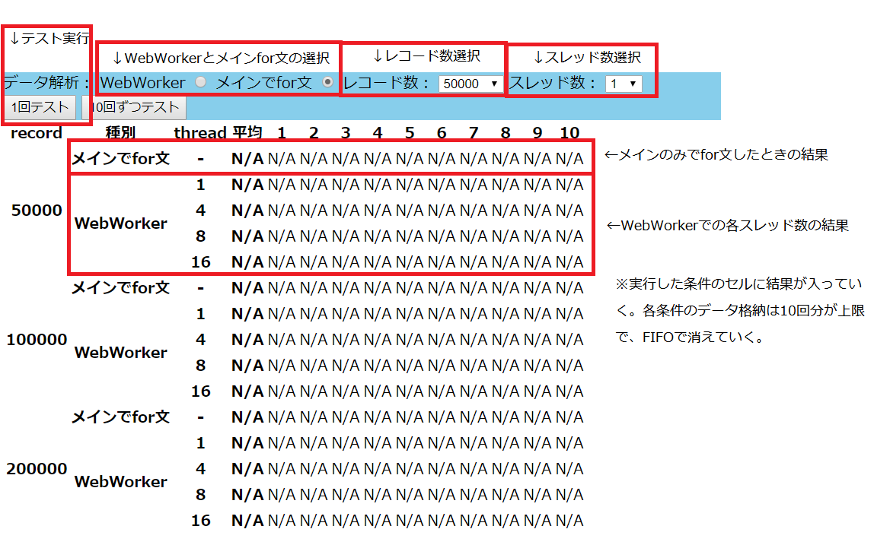
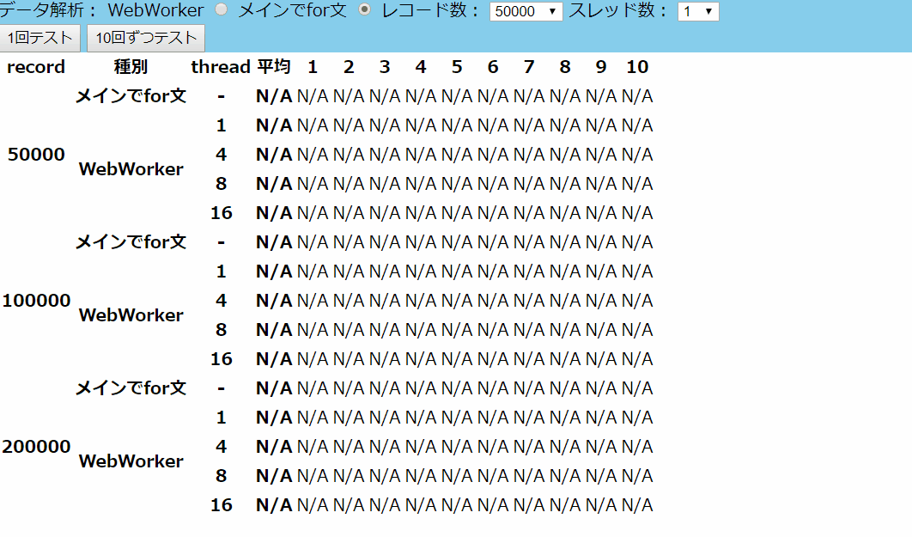

### 7.2_Main

Web Workerと通常for文で処理速度を比較するツール。

ローカルに格納してあるCSVファイルをダウンロードし、指定したセルに存在する数値を平均して値を取得するまでにかかった時間(ms)を画面に表形式で表示する。

#### 前提

- python 3.x系 : ローカルサーバ立ち上げバッチで利用している。ブラウザ上でhtmlを見るのに別の方法を用いるなら不要。
    - ```$ python```で動作するようにpathを設定しておくこと

- 以下のフォルダ構成・ファイル名でファイルを格納すること。
    
    なお、著者が実施した際は以下のファイルを取得し、改変し利用させていただいた。  
    日本比較教育学会「比較・国際教育情報データベース」(CSVフォーマット)
    http://jces.sakura.ne.jp/rice/update.shtml

#### ツール使用方法

 1. $ git clone \<repository URL\>
 1. $ cd \<cloned path\>\7.2_Main\WebContent\
 1. $ openserver.bat
      - 要python3.x、もし別の手段でhttpサーバを立ち上げるならば、この手順は不要
 1. ブラウザを立ち上げ、以下に接続する
    - http://127.0.0.1:8000
 1. 画面構成は以下の通り
    
 1. 適宜クリックし、結果を見る。
    
