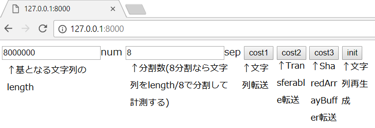
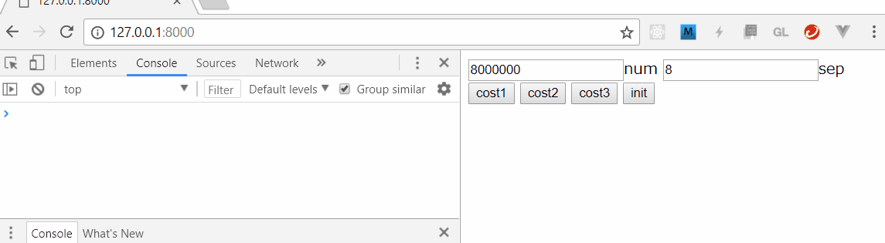

### 7.2_Main

Web Workerと通常for文で処理速度を比較するツール。


#### 前提パッケージ

- python 3.x系 : ローカルサーバ立ち上げバッチで利用している。ブラウザ上でhtmlを見るのに別の方法を用いるなら不要。
    - ```$ python```で動作するようにpathを設定しておくこと

#### ツール使用方法

 1. $ git clone \<repository URL\>
 1. $ cd \<cloned path\>\7.2_DataTransferForWorker\WebContent\
 1. $ openserver.bat
 1. ブラウザを立ち上げ、以下に接続する
    - http://127.0.0.1:8000
 1. ブラウザでF12キーを押し、開発者ツールを表示する（コンソールに結果が出るため）
 1. 画面構成は以下の通り
    
 1. 適宜クリックし、結果をコンソールに表示する。
    
